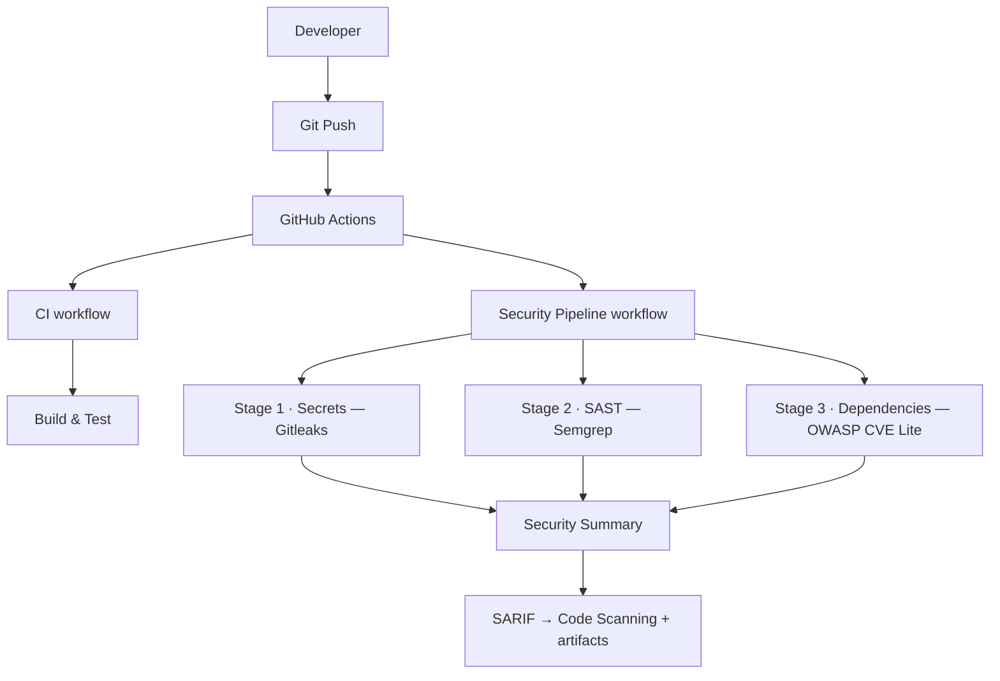

# PortScope

[](https://github.com/yogi822/portscope/actions/workflows/ci.yml)

A small, secure, local web GUI for running **authorized, limited** [Nmap](https://nmap.org/)
scans and viewing the results in a clean dashboard.

> ⚠️ **Authorized use only.** Only scan systems you own or are explicitly
> authorized to test. Unauthorized port scanning may be illegal in your
> jurisdiction. You are solely responsible for how you use this tool.

---

## What it does

PortScope lets an authorized user enter a target domain or IP, choose one of two
safe scan profiles, run the scan, and view the results — open ports, protocol,
service name, and version — in a browser dashboard. Scan history is kept for the
session and exposed over a small REST API with OpenAPI/Swagger docs.

Only two non-aggressive, allow-listed scan profiles are supported:

| Profile | Command |
|---------|---------|
| **Quick Scan** | `nmap -sT -T3 --top-ports 100` |
| **Service Detection** | `nmap -sT -sV -T3 --top-ports 50` |

The client never supplies raw Nmap flags — it only picks a scan type. There is no
support for aggressive timing, NSE attack scripts, brute force, evasion,
spoofing, or any destructive option.

## Tech stack

- **Backend:** Node.js, TypeScript, Express
- **Frontend:** React, Vite, Tailwind CSS
- **Validation:** zod
- **XML parsing:** xml2js (parses Nmap's `-oX` output)
- **Logging:** pino / pino-http (structured JSON logs)
- **API docs:** OpenAPI 3 (generated from zod) + Swagger UI
- **Tests:** Vitest
- **Tooling:** npm workspaces monorepo

## Architecture overview

PortScope is split into three backend packages plus the client, so the public
API can later run on **Cloudflare Workers** while Nmap stays in a separate,
trusted service. **Cloudflare Workers must never run Nmap** — that is the whole
point of the split.

```
                       ┌──────────────────────────────────────────┐
 client (React, Vite)  │  worker-api  (Hono)                       │
   │  /api  ─proxy──►   │  public API · validation · auth-ready ·   │
   │                    │  rate limiting · scan orchestration       │
   │                    │  runs on Node today, Cloudflare Workers   │
   │                    │  later — SAME code                        │
   │                    └───────────────┬──────────────────────────┘
   │                        HTTP (SCANNER_AGENT_URL)
   │                                    ▼
   │                    ┌──────────────────────────────────────────┐
   │                    │  scanner-agent  (Express, Node)           │
   │                    │  TRUSTED internal service · resolve-first │
   │                    │  gating · runs Nmap (spawn) · parses XML   │
   │                    └──────────────────────────────────────────┘

              shared  (@portscope/shared): types · zod schemas · target
              validation — pure, no node:* — imported by worker + agent
```

- **`worker-api`** (Hono) — the public API. Validates input, is auth-ready, rate
  limits, and orchestrates the scan lifecycle (`pending → running →
  completed | failed`). It calls the scanner-agent over HTTP via `fetch` and
  **never executes Nmap**. The same Hono app runs locally on Node
  (`@hono/node-server`) and on Cloudflare Workers later (`src/worker.ts` is the
  prepared Workers entrypoint).
- **`scanner-agent`** (Express) — a trusted internal Node service, the **only**
  component that runs Nmap. It performs resolve-first private-range gating, runs
  the allow-listed scan via `spawn`, and parses the XML. Not internet-facing.
- **`shared`** (`@portscope/shared`) — runtime-agnostic types, zod schemas, and
  syntactic target validation (pure, no `node:*`), imported by both services.
- **Storage** — `InMemoryScanRepository` behind a `ScanRepository` interface in
  the worker; a Supabase implementation swaps in later with no service changes.

> The Express-based Swagger UI from the previous version was removed during the
> Workers migration (Express is not Workers-portable). API docs will return via a
> Workers-compatible route in a later milestone.

---

## Local setup

### Prerequisites

- **Node.js ≥ 18.17** and npm
- **Nmap** installed and on your `PATH`

### Installing Nmap

| OS | Command |
|----|---------|
| Debian/Ubuntu | `sudo apt install nmap` |
| Fedora/RHEL | `sudo dnf install nmap` |
| Arch | `sudo pacman -S nmap` |
| macOS (Homebrew) | `brew install nmap` |
| Windows | Download the installer from <https://nmap.org/download.html> |

Verify with `nmap --version`. If Nmap isn't on your `PATH`, set `NMAP_BIN` to its
full path (see configuration below).

### Install & configure

```bash
git clone https://github.com/yogi822/portscope.git
cd portscope
npm install                 # installs all workspaces (shared, worker-api, scanner-agent, client)
cp .env.example .env        # optional; defaults are sensible
```

## How to run the app

```bash
npm run dev                 # builds shared, then runs worker-api :3001 +
                            # scanner-agent :3002 + client :5173 together
```

Then open **http://localhost:5173**.

- `npm run dev` builds `@portscope/shared` first, then starts all three services
  with `concurrently`.
- The Vite dev server proxies `/api` → `http://localhost:3001` (worker-api), so
  the browser only talks to one origin (no CORS setup needed).
- The worker-api reaches the scanner-agent at `SCANNER_AGENT_URL`
  (default `http://localhost:3002`).

`-sT` (TCP connect) scans are used, so **no root/sudo is required.**

### Example: a safe target you're allowed to scan

The Nmap project hosts **`scanme.nmap.org`** specifically for testing. Enter it as
the target, choose **Quick Scan**, and click **Run Scan**.

```bash
curl -s -X POST http://localhost:3001/api/scans \
  -H 'Content-Type: application/json' \
  -d '{"target":"scanme.nmap.org","scanType":"quick"}'
```

### Other scripts

```bash
npm test                    # all workspace suites (shared, worker-api, scanner-agent)
npm run build               # build shared → scanner-agent → worker-api → client
```

You can also run a single service, e.g. `npm run dev:worker`, `npm run dev:scanner`,
or `npm run dev:client`.

## Configuration

Environment variables (all optional; defaults shown):

| Variable | Service | Default | Description |
|----------|---------|---------|-------------|
| `PORT` | both | `3001` (worker) / `3002` (agent) | Port each service listens on |
| `SCANNER_AGENT_URL` | worker-api | `http://localhost:3002` | URL the worker calls to run scans |
| `LOCAL_SCAN_ENABLED` | both | `false` | Allow scanning private/internal ranges when `true` |
| `SCAN_TIMEOUT_MS` | both | `60000` | Per-scan timeout / worker call budget |
| `RATE_LIMIT_MAX` | worker-api | `5` | Max scans per window, per IP |
| `RATE_LIMIT_WINDOW_MS` | worker-api | `300000` | Rate-limit window (5 min) |
| `NMAP_BIN` | scanner-agent | `nmap` | Path to the Nmap binary |
| `HISTORY_LIMIT` | worker-api | `50` | Scans retained in memory |
| `LOG_LEVEL` | both | `info` | Log level |

## REST API

Base URL: `http://localhost:3001`

| Method | Path | Description |
|--------|------|-------------|
| `POST` | `/api/scans` | Create & run a scan. Body: `{ "target": "...", "scanType": "quick" \| "service" }` |
| `GET` | `/api/scans` | List scan history (newest first) |
| `GET` | `/api/scans/:id` | Get one scan (full parsed result) |
| `GET` | `/api/health` | Health check |

---

## Security controls

- **Allow-listed scans only.** The client selects a `scanType` enum; it can never
  supply raw Nmap flags. Aggressive modes, NSE attack scripts, brute force,
  evasion, spoofing, and destructive options are not supported.
- **No shell.** Scans run via `child_process.spawn` with a fixed argument array —
  never a shell string, never string interpolation.
- **Strict input validation.** Targets must be a valid domain or IP, ≤253 chars,
  with no shell metacharacters (defence in depth).
- **Resolve-first private-range block.** Domain targets are resolved to their
  IP address(es) **before** scanning; if any resolved address is
  private/loopback/link-local/CGNAT/ULA/multicast/reserved the scan is blocked,
  and the scan is **pinned to the vetted IP** (Nmap scans that address, not the
  name) — closing the TOCTOU gap. IP literals are gated directly.
  `LOCAL_SCAN_ENABLED=true` is the only way to permit private/local targets.
- **Timeout & rate limiting.** 60s per scan; 5 scans / 5 minutes per IP by default.
- **Safe errors.** Internal details (stderr, stack traces) are logged, never
  returned to the client; clients receive categorized, safe messages.

## Limitations

- **No authentication** — intended to run **locally only**. Do not expose it to
  untrusted networks.
- **In-memory history** — scan history is lost when the server restarts.
- **Single-node rate limiting** — the limiter is process-local.
- **TCP connect scans only** (`-sT`) — no SYN scans, by design (no root needed).

## Authorized-use disclaimer

PortScope is intended for **authorized security testing and educational use only**.
You must have explicit permission to scan any target that you do not own.
Unauthorized scanning may violate computer-misuse and anti-hacking laws. The
authors accept no liability for misuse. By using this tool you agree that you are
solely responsible for ensuring your scans are lawful and authorized.

## CI/CD

Every pull request to `main` and every push to `main` runs a GitHub Actions
workflow ([`.github/workflows/ci.yml`](./.github/workflows/ci.yml)) on
`ubuntu-latest` with Node.js 22. It:

- installs dependencies (`npm ci` when `package-lock.json` is present, otherwise
  `npm install`), with npm dependency caching;
- runs the test suite (`npm test`);
- type-checks and builds both workspaces (`npm run build`);
- runs a **non-blocking** security audit (`npm audit --audit-level=high`) — the
  result is printed but does not fail the build for now.

Nmap is **not** installed in CI: the tests use XML fixtures and an injected fake
DNS resolver, so no real scans run.

## Security Pipeline

In addition to CI, a dedicated **DevSecOps** workflow
([`.github/workflows/security.yml`](./.github/workflows/security.yml)) runs on
every push and pull request to `main`, on a **weekly schedule** (to catch
newly-disclosed CVEs), and on manual dispatch. Each stage is **blocking** — the
workflow fails immediately if a tool reports findings at its threshold.



The three security stages share a reusable composite action
([`.github/actions/publish-security-report`](./.github/actions/publish-security-report/action.yml))
that uploads each tool's SARIF to Code Scanning and archives its report, and a
final **Security Summary** job renders a grouped pass/fail table in the run
summary. Tool and runtime versions are defined once in a workflow-level `env`
block.

- **Gitleaks** — scans the entire git history for hard-coded secrets (API keys,
  tokens, private keys). Uses the default ruleset with only `node_modules/`,
  `dist/`, and `build/` allowlisted ([`.gitleaks.toml`](./.gitleaks.toml)).
  **Fails on any detected secret.**
- **Semgrep** — static application security testing over the source using the
  `p/security-audit`, `p/owasp-top-ten`, `p/nodejs`, and `p/typescript` rule
  packs. **Fails on any ERROR-severity finding.**
- **OWASP CVE Lite CLI** — scans the JavaScript/TypeScript dependency lockfile
  for known vulnerabilities. **Fails when any HIGH or CRITICAL vulnerability is
  found** (`fail-on: high` exits non-zero at or above HIGH; MEDIUM/LOW/UNKNOWN do
  not fail the build). It emits a SARIF 2.1.0 report and a JSON report.

  **Why OWASP CVE Lite CLI instead of Trivy?** It is purpose-built for
  JavaScript/TypeScript dependency scanning and is lockfile-aware (reads
  `package-lock.json` directly, no install needed); it is developer-focused,
  producing copy-and-run remediation guidance for direct and transitive
  dependencies rather than just a vulnerability list; it is an **OWASP project**,
  which fits a security-focused tool; and it is better aligned with this
  project's Node/TypeScript architecture than a general-purpose container/OS
  scanner.

Each stage produces a report: SARIF is uploaded to **GitHub Code Scanning** and
also stored as a build **artifact** (`gitleaks-report`, `semgrep-report`,
`cve-report`), so findings are visible in the Security tab and downloadable from
the run. Unit tests and build live in the separate CI workflow (see above).

## Roadmap

- [x] CI pipeline (test, build, audit) — GitHub Actions
- [x] DevSecOps security pipeline (Gitleaks, Semgrep, OWASP CVE Lite CLI)
- [x] Workers-ready architecture — Hono worker-api + separate scanner-agent + shared package
- [ ] Deploy worker-api to Cloudflare Workers (add `wrangler.toml`, read `env` bindings)
- [ ] Persistent storage backend (Supabase) behind the `ScanRepository` interface
- [ ] Authentication / multi-user support (auth-ready hook already in place)
- [ ] Asynchronous scan jobs (the status model is already in place)
- [ ] Re-introduce a Workers-compatible OpenAPI/docs route

## License

For authorized security testing and educational use.
